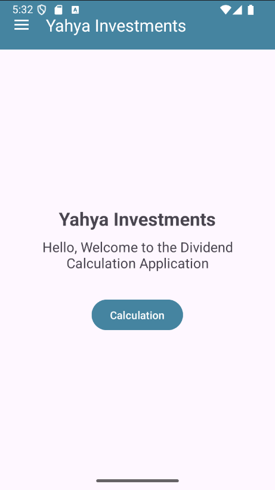
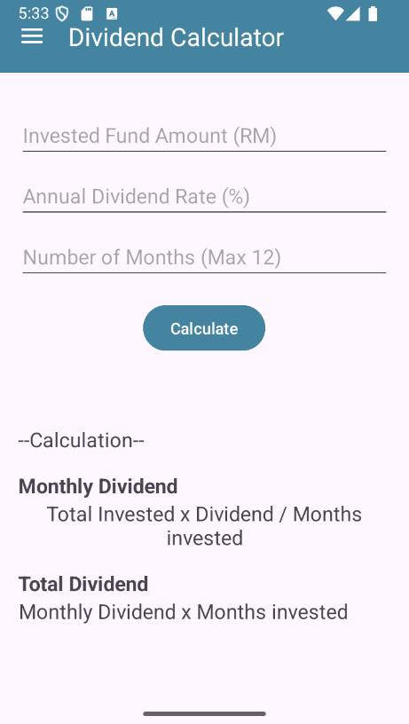

# Yahya Investments

This is a mobile Android application developed in Java using Android Studio for ICT602. The app allows users to calculate dividends from unit trust investments.

## 📱 Features

- Accepts:
  - Invested Fund Amount (RM)
  - Annual Dividend Rate (%)
  - Number of Months (1–12)
- Calculates and displays:
  - Monthly Dividend
  - Total Dividend
- User-friendly interface with navigation menu:
  - Home
  - Calculate
  - About

## 📂 Activities

- `HomeActivity.java` – Welcome page with navigation
- `CalculateActivity.java` – Input and calculation
- `AboutActivity.java` – Author info and GitHub link

## 📸 Screenshots

| Home Screen | Calculation Page | About Page |
|-------------|------------------|-------------|
|  |  |  |

## 🧑‍💻 Author

- **Name**: Yahya Naim bin Md Rofiee  
- **Matric No**: 2023115911  
- **Course**: ICT602 Mobile Technology and Development  
- **GitHub Repo**: [https://github.com/yahyarofiee/IndividualAssignmentLab_ICT602]

## 🏗 How to Build

1. Open this project in Android Studio
2. Go to `Build > Build APK(s)`
3. Find the APK in: `app/build/outputs/apk/debug/app-debug.apk`

## 📄 License

This project is developed as part of the ICT602 Mobile Technology and Development Lab assignment.

